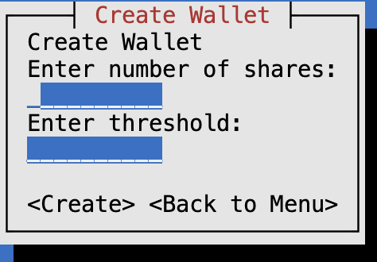
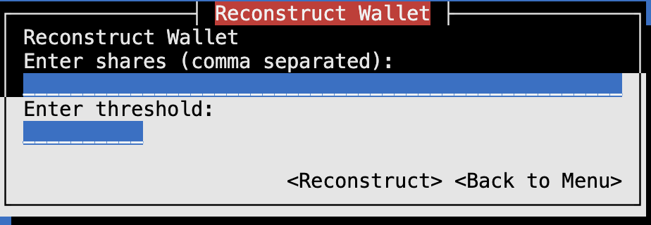
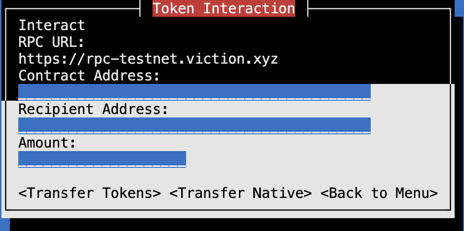
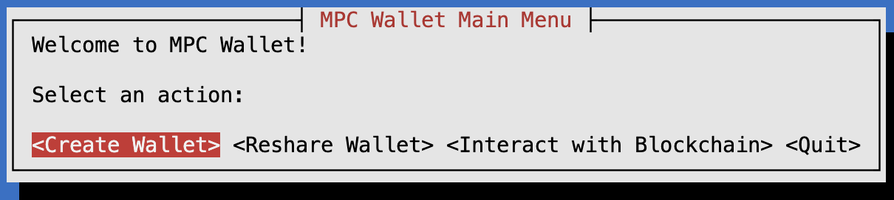

# mpc-wallet

mpc-wallet is a Rust-based wallet application implementing secure multi-party computation (MPC) for BIP-39 mnemonic management and Ethereum wallet operations. It supports wallet creation, mnemonic splitting and reconstruction, Shamir secret sharing, and direct interaction with EVM-compatible blockchains.

## Features

- Create and split BIP-39 mnemonics into shares
- Reconstruct mnemonics from shares
- Generate Ethereum addresses and private keys from mnemonics
- Interact with smart contracts and transfer tokens on EVM chains
- User-friendly terminal UI
## Details
1. Create Wallet


2. Reconstruct Wallet


3. Interact Wallet


4. Main menu

## Getting Started

1. **Install Rust**  
   [Install Rust](https://www.rust-lang.org/tools/install) if you haven't already.

2. **Clone the repository**
   ```sh
   git clone https://github.com/yourusername/mpc-wallet.git
   cd mpc-wallet
   ```
